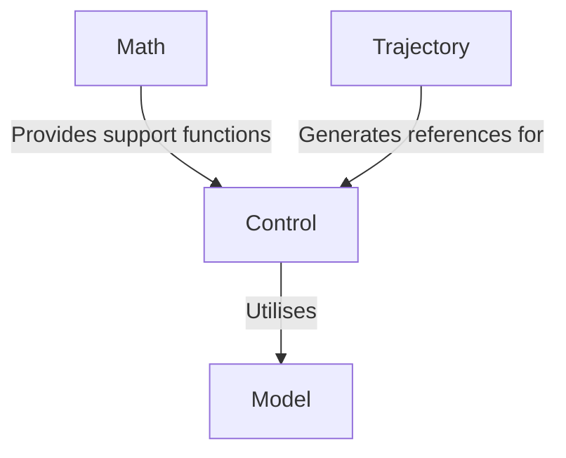
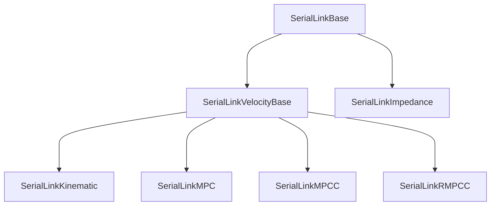

# :control_knobs: Control

[:back: Back to the Foyer](../README.md)

The `Control` sublibrary provides classes for real-time feedback control of robots. At present it is only capable of handling serial link robot arms.

The classes build upon the [Model](../Model/README.md) sublibrary and provide a seamless API to optimise the control of robots subject to actuator constraints. It is designed to integrate with the [Trajectory](../Trajectory/README.md) sublibrary where you can easily generate and pass reference trajectories to the controller.



## Controller Families

Public headers are organized by controller purpose:

- `Control/Core`: shared serial-link interfaces, parameters, and resolved-rate control.
- `Control/TrajectoryTracking`: kinematic, MPC, MPCC, and RMPCC trajectory trackers.
- `Control/Contact`: admittance, impedance, and moving-frame contact controllers.

Prediction, residual-linearisation, and progress-constraint helpers live under
`src/TrajectoryTracking/detail`; they are implementation details and are not installed.

The former flat forwarding headers are retained under
`archive/legacy_flat_api` as migration references, but they are no longer installed.
Consumers must use the categorized paths, for example:

```cpp
#include <Control/TrajectoryTracking/SerialLinkRMPCC.h>
#include <Control/Contact/SerialLinkImpedance.h>
```

The main public controllers are:

- [SerialLinkBase](doc/SerialLinkBase.md): common serial-link controller interface.
- [SerialLinkKinematic](doc/SerialLinkKinematic.md): resolved-rate trajectory tracking.
- `SerialLinkMPC`, `SerialLinkLieAlgebraMPC`, `SerialLinkMPCC`,
  `SerialLinkCartesianMPCC`, and `SerialLinkRMPCC`: trajectory-tracking controllers.
- [SerialLinkImpedance](doc/SerialLinkImpedance.md),
  `AdmittanceContactController`, and `SerialLinkMovingFrameMPC`: contact-oriented controllers.



[:top: Back to Top](#control_knobs-control)
