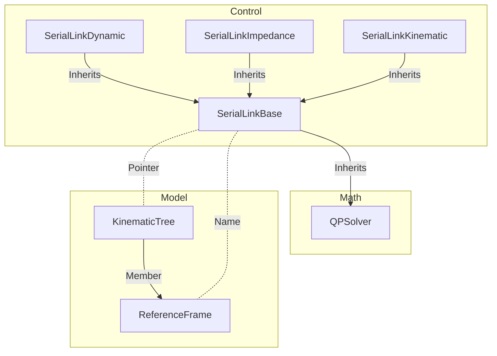
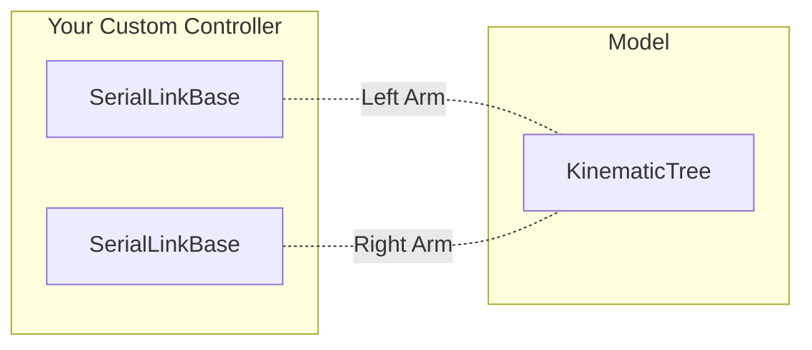

# SerialLinkBase

The `SerialLinkBase` class is designed to give a common structure to all control classes for serial link robots. This way it is possible command a robot in velocity or torque mode without having to change the motion planning for a given task.

As can be seen in the diagram below, it builds upon several important elements:
- It inherits a [QPSolver](https://github.com/Woolfrey/software_simple_qp) which is used by the child classes when solving Cartesian control,
- It takes a pointer to a `RobotLibrary::Model::KinematicTree` object which it uses to access the current forward kinematics & inverse dynamics properties, and
- It requires the name of a `ReferenceFrame` on the `KinematicTree` object, which it uses for computing the Jacobian matrix during Cartesian control.

The use of the pointer to the `KinematicTree` is deliberate. In branching structures, such as humanoid robots, it is necessary to control multiple limbs. A single `SerialLinkBase` can be assigned to the endpoint of each limb. Each controller will compute its own unique Jacobian for independent control, but ensures that both utilise the same kinematics & dynamics properties.

